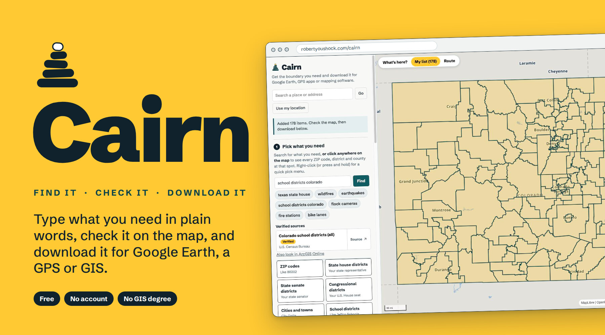
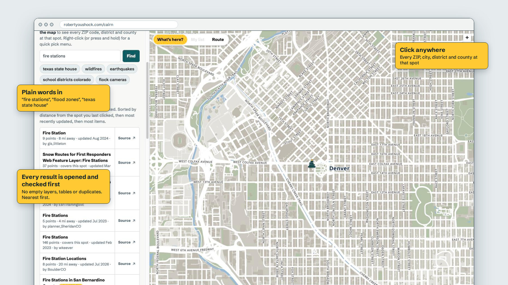
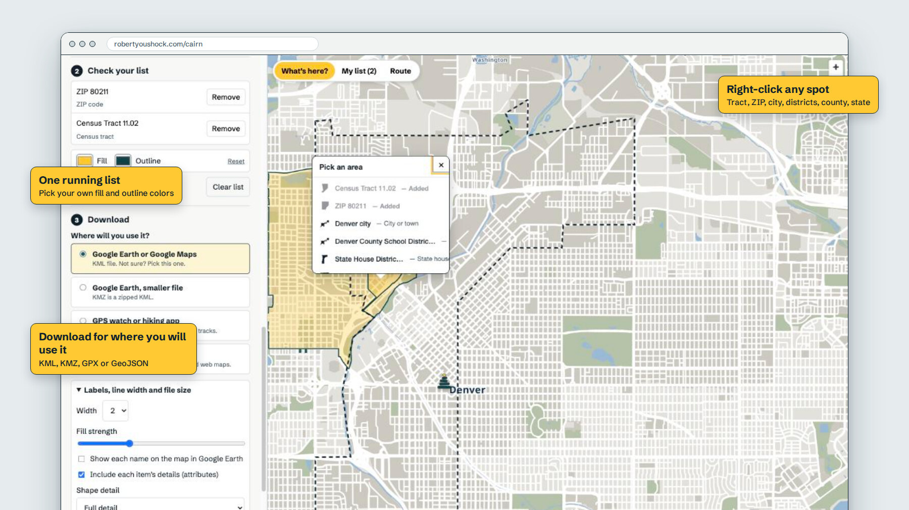
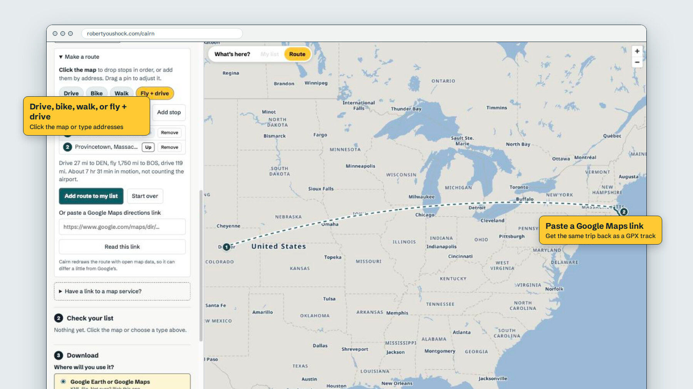
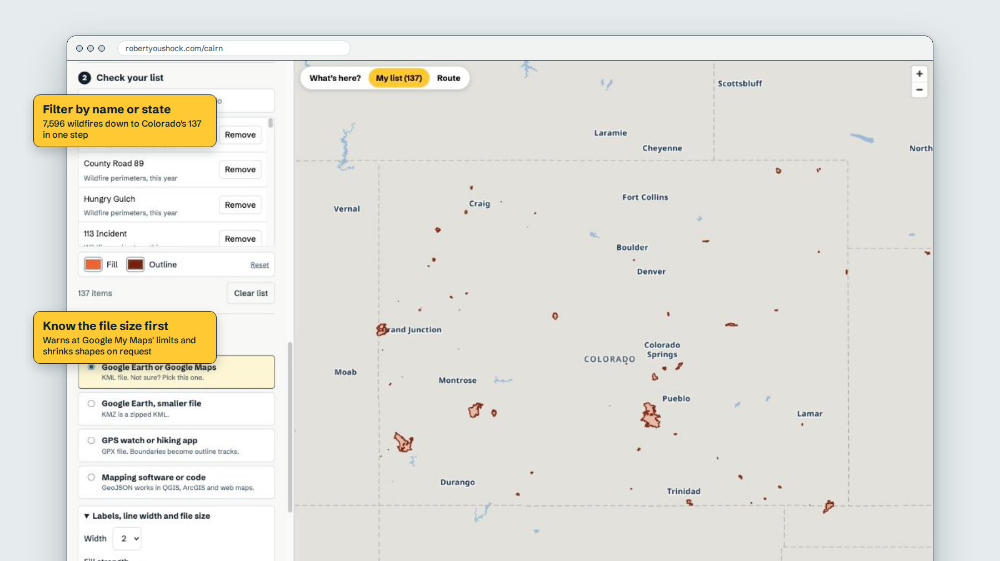
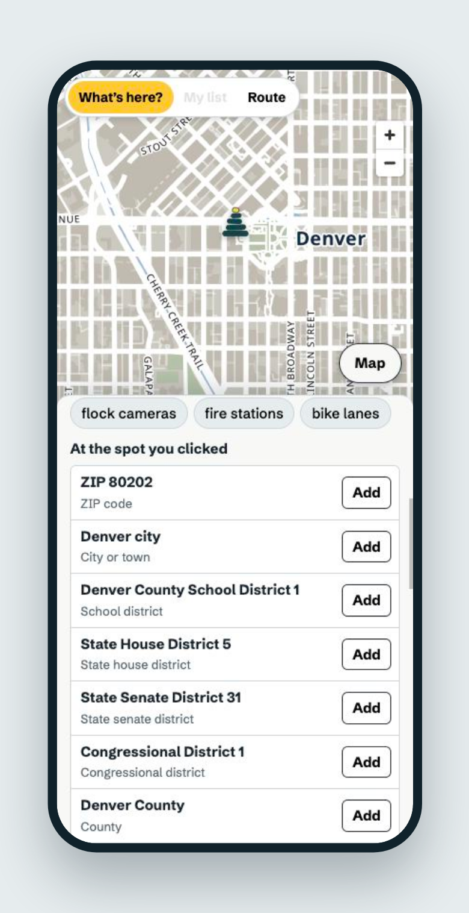
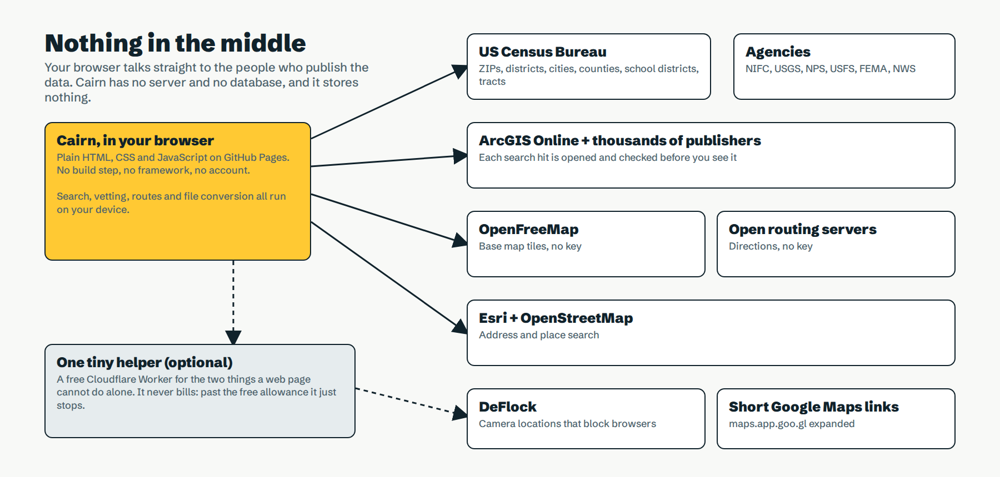

<p align="center">
  
</p>

# Cairn

**Find the map boundary you need in plain words. Check it. Download it.**

Cairn is a free web tool for getting US map data out of the places it hides and into the tools people actually use. Type "texas state house" or "flood zones", see it on the map, and download a file that opens in Google Earth, a GPS watch or GIS software. It's built for people who have never opened ArcGIS, and it's quick enough for people who use it every day.

There's no account, no ads and no tracking. Nothing is stored anywhere: your list lives in your browser tab and goes away when you close it.

`Vanilla JS` · `No build step` · `No server` · `MapLibre` · `KML · KMZ · GPX · GeoJSON` · `$0 a month`

**[Open Cairn →](https://robertyoushock.com/cairn/)**

---

## Search like a person



Public map data is easy to find and hard to trust. A normal search returns ten results with the same name: some are empty, some are tables with no shapes, and some label every shape with an ID number. Cairn does the checking for you.

- **Verified first.** Census boundaries are understood from plain words ("boulder city limits colorado", "census tracts ohio"). A hand-checked catalog covers wildfires, earthquakes, flood zones, weather alerts, national parks and forests, trails, and license plate reader cameras.
- **Marathon courses.** Search "denver marathon" or "nyc marathon" for the course, with water stations, mile markers and medical stations where the organizer publishes them. Eleven races so far: Denver, New York City, Boston, Miami, Los Angeles, Chicago, Marine Corps, Oklahoma City, Twin Cities, St. George and Anchorage.
- **Everything else is opened before you see it.** Each ArcGIS Online result is fetched and inspected. Empty layers, tables and duplicates are dropped. What's left says how many shapes it has, how fresh it is and who published it.
- **Nearest first.** Results are ranked by distance from the last spot you clicked, then by last update, then by size. Search "fire stations" from Denver and you get Denver's.
- **Names that make sense.** Many layers label shapes by the wrong field. One fire layer's default is the incident commander, which is blank. Cairn picks a real name field, shows you three sample names before you add anything, and lets you change it.
- **Always a way back to the source.** Every result links to the publisher's own page.

## Or just point



- **Click the map** to list every ZIP code, city, school district, legislative district and county at that spot.
- **Right-click** for a quick menu of the same, from census tract up to the whole state, each with a small outline of its shape. Click a row and it's in your list.
- **Click what you've added** to inspect it, remove it, or keep only that one.
- **Fill and outline colors** sit right next to the list, and the map follows them.

## Routes, including the flying part



- **Drive, bike or walk** between stops you click or type.
- **Fly + drive** finds the major airport near each end, draws the drive to it, the flight as a great-circle arc, and the drive out the other side.
- **Paste a Google Maps directions link** and get the same trip back as a GPX track for a watch or bike computer.
- Directions come from open routing servers. There's no key and no quota to pay for.

## Big data, small files



- **Filter the list** by a name or a state, then keep or remove the matches. "Colorado" also finds rows that only say CO.
- **Know the size before you download.** Cairn estimates the file and warns you at the limits that bite: Google My Maps stops at 5 MB and 2,000 items.
- **Four detail levels** round off corners without dropping anything. Colorado's 178 school districts go from 5.2 MB to 0.5 MB.
- **Download for where you'll use it:** Google Earth or Google Maps (KML, KMZ), GPS watches and hiking apps (GPX), mapping software (GeoJSON). Colors, name labels and attributes carry into Google Earth.

## Works on a phone too

<table>
<tr>
<td width="34%"></td>
<td>

Cairn is designed for a desk, where the map has room. On a phone the menu becomes a sheet under the map, and one button switches between the two. It's enough to look something up and send yourself the file.

**The pin is a cairn.** So is the logo: five stacked stones, the trail marker hikers leave to say "this way". It seemed right for a tool whose job is pointing at the correct boundary.

</td>
</tr>
</table>

---

## How it's built



- **About 3,500 lines of plain HTML, CSS and JavaScript.** There's no framework and no bundler; the files in this repo are what runs.
- **No server.** Each visitor's browser talks straight to the data publishers, so more visitors don't cost anything.
- **Vetting happens live.** Search hits are probed in parallel and results appear as they pass.
- **Census layers are found by name,** because their ID numbers change with every release.
- **Pure functions, tested.** Conversion, simplification, search ranking, link parsing and the helper are covered by 8 test files that run with no network: `npm test`.
- **Checks that run themselves.** GitHub runs the tests on every push. Once a week it opens every verified source and files an issue here if one has moved, emptied out or lost its name field.

### Staying free

Cairn is public, so nothing in it is allowed to run up a bill.

| Piece | Service | Key needed | Under heavy use |
| --- | --- | --- | --- |
| Hosting | GitHub Pages | none | a few hundred KB a visit |
| Boundaries | US Census TIGERweb | none | public service |
| Search | ArcGIS Online and each publisher | none | per-publisher limits |
| Base map | MapLibre + OpenFreeMap | none | donation funded |
| Directions | FOSSGIS OSRM, then Valhalla | none | fair use; the second takes over if the first throttles |
| Place search | Esri, OpenStreetMap Nominatim | none | throttles |
| Helper | Cloudflare Workers, free plan | none | stops at 100,000 requests a day; never bills |

The rules that keep it that way are at the top of [`docs/HANDOFF.md`](docs/HANDOFF.md).

## Design notes

- **Type:** [Schibsted Grotesk](https://fonts.google.com/specimen/Schibsted+Grotesk), heavy for the wordmark and headings, regular for reading.
- **Color:** a field-notebook palette.

  | Token | Hex | Used for |
  | --- | --- | --- |
  | Tape | `#FFC933` | what's selected, what's yours |
  | Deep teal | `#0A4349` | outlines, primary buttons |
  | Ink | `#10222B` | text |
  | Paper / Fog | `#F8F9F7` / `#E6ECEE` | panel and page |

- **Base map:** a quiet custom style so your shapes are the loudest thing on screen.
- **Words:** no GIS vocabulary where a plain word works. "Shapes", not "features". "Name each shape by", not "label field".
- **Honest failures:** when something can't be done, Cairn says so and says why, instead of loading an empty layer.

## Built in versions

| | Added |
| --- | --- |
| v1 | Census boundaries, click the map to identify, ArcGIS search, KML / KMZ / GPX / GeoJSON export |
| v2 | Guided search: verified catalog, plain-language boundaries, vetted results, preview with a name picker |
| v3 | Map click modes, distance ranking, source links |
| v4 | Routes, Google Maps links, list filter, colors and labels, detail levels, more verified sources, the helper |
| v5 | Right-click pick menu, the cairn icon, phone layout, automated checks, this page |
| v6 | Marathon courses with water stations and mile markers, a backup routing server |

## Run it yourself

```sh
npm test      # every check, no network needed
npm start     # serves the folder; ES modules need a server
```

Deploy is GitHub Pages from `main`. The optional helper is one file in [`worker/`](worker/). Adding a verified source is one entry in [`data/catalog.json`](data/catalog.json); the how-to is in the handoff document.

**Not yet checked in a real browser:** short Google Maps links (maps.app.goo.gl) and the OpenRouteService backup, which needs a key that hasn't been added.

## Credits

Designed and built by **[Robert Youshock](https://github.com/robertyoushock)** in Denver, with Claude (Anthropic) as a coding partner. Say hi on [LinkedIn](https://www.linkedin.com/in/robert-youshock-1ba979108/).

Boundaries from the US Census Bureau. Verified sources from NIFC, USGS, the National Park Service, the USDA Forest Service, FEMA, the National Weather Service and DeFlock. Map data © [OpenStreetMap](https://www.openstreetmap.org/copyright) contributors, tiles by [OpenFreeMap](https://openfreemap.org), rendering by [MapLibre GL JS](https://maplibre.org). Airport locations from OurAirports. Full list: [credits](https://robertyoushock.com/cairn/credits.html).

Cairn's code is open source under the [MIT License](LICENSE). The data it helps you download belongs to its publishers and keeps their terms.
